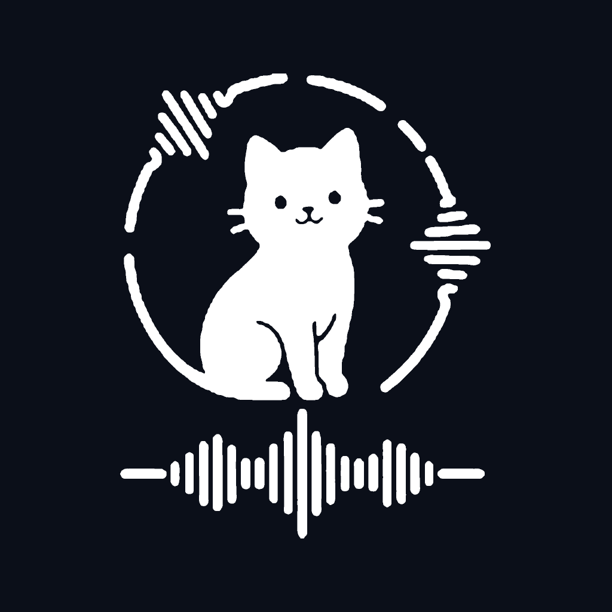

# 🐱 MEOWSHADOW LAB
### NỀN TẢNG LUYỆN NGHE & NHẠI GIỌNG ĐA NGỮ CHUẨN PODCAST (VIỆT - ANH - NHẬT)
#### KIẾN TRÚC POLYGLOT MICROSERVICES (GOLANG + PYTHON) • 100% DOCKER-FIRST • WEB & MOBILE

---

<p align="center">
  
</p>

<p align="center">
  
  
  
  
  
  
</p>

---

## 📖 GIỚI THIỆU DỰ ÁN (PROJECT OVERVIEW)

**MeowShadow Lab** là hệ thống luyện nghe và phản xạ nhại giọng đa ngữ (**Việt - Anh - Nhật**) thông minh, được thiết kế để giải quyết bài toán cốt lõi của người học ngoại ngữ: **Nghe hiểu thụ động (Passive Listening) kết hợp nhại giọng chủ động (Shadowing) theo chuẩn âm thanh Podcast chuyên nghiệp.**

Hệ thống cho phép người dùng đưa vào văn bản thô 1.300 – 1.500 từ, sử dụng AI (Qwen 2.5) tự động phân đoạn và dịch thuật, sau đó ghép nối âm thanh với quy tắc khoảng lặng thông minh (**Smart Silence Pacing**):
* **`0.5s`** giữa các câu trong cùng khối.
* **`1.5s`** sau khối Tiếng Việt (chuyển đổi ngữ cảnh tư duy).
* **`3.5s`** sau khối Ngoại ngữ (thời gian vàng để người học nhại lại câu - Shadowing).
* Chuẩn hóa âm lượng tự động theo tiêu chuẩn phát thanh truyền hình **EBU R128 (-16 LUFS)**.
* Đồng bộ âm thanh và phụ đề Karaoke từng câu với độ trễ siêu thấp qua **HTTP Range Audio Streaming (206 Partial Content)**.

---

## 📂 TRUNG TÂM TÀI LIỆU KỸ THUẬT (DOCUMENTATION HUB)

Toàn bộ tài liệu phân tích, kiến trúc, thiết kế API và lộ trình dự án được quy hoạch bài bản trong thư mục [`docs/`](./docs):

| Tài liệu | Văn bản kỹ thuật | Nội dung tóm tắt |
| :--- | :--- | :--- |
| **[`1_SRS.md`](./docs/1_SRS.md)** | Đặc tả yêu cầu phần mềm (SRS) | Nghiệp vụ Pacing (0.5s - 1.5s - 3.5s), chuẩn EBU R128 (-16 LUFS), bảng giọng đọc Edge-TTS, tính năng Web & Mobile. |
| **[`2_ARCHITECTURE_TECHSTACK.md`](./docs/2_ARCHITECTURE_TECHSTACK.md)** | Kiến trúc hệ thống & Database | Sơ đồ Polyglot Microservices, Go Fiber API Gateway, Python AI Workers, Schema PostgreSQL 16 (JSONB & GIN Index), Redis 7. |
| **[`3_DOCKER_CONTAINERIZATION.md`](./docs/3_DOCKER_CONTAINERIZATION.md)** | Hạ tầng 100% Docker-First | Cấu hình `docker-compose.yml`, multi-stage builds, mạng nội bộ `meowshadow-network` và volume lưu trữ audio. |
| **[`4_API_AND_DATA_SCHEMAS.md`](./docs/4_API_AND_DATA_SCHEMAS.md)** | Hợp đồng API & Kiểu dữ liệu | RESTful APIs (Auth, Lessons, Progress, Audio), WebSocket Realtime, Error responses và TypeScript Interfaces `@meowshadow/types`. |
| **[`5_SPRINT_PLAN.md`](./docs/5_SPRINT_PLAN.md)** | Kế hoạch lộ trình 5 Sprint | Kế hoạch triển khai chi tiết từ Hạ tầng Docker & Audio Worker đến Go Gateway, Web Studio và Mobile App. |
| **[`6_DEVELOPMENT_GUIDE_AND_ENV.md`](./docs/6_DEVELOPMENT_GUIDE_AND_ENV.md)** | Quy chuẩn code, Env & Rủi ro | Quy tắc Git, Conventional Commits, Code conventions, bảng biến môi trường `.env`, cấu hình phần cứng và quản trị rủi ro. |
| **[`assets/logo/README.md`](./assets/logo/README.md)** | Tài nguyên Thương hiệu & Logo | Bộ nhận diện vector SVG, PNG 1024px, Dark/Light Mode, Favicon và mẫu Next.js Brand Component. |

---

## 🏗️ CẤU TRÚC MONOREPO TOÀN DỰ ÁN

```text
MeowShadow_Lab/
├── README.md                       # Trang chủ dự án & Giới thiệu tổng quan
├── .env.example                    # Mẫu cấu hình tất cả biến môi trường
├── docker-compose.yml              # Điều phối toàn bộ các container (Sprint 1)
├── docs/                           # Bộ tài liệu kỹ thuật dự án (SRS, Arch, API, Sprint...)
│   ├── README.md
│   ├── 1_SRS.md
│   ├── 2_ARCHITECTURE_TECHSTACK.md
│   ├── 3_DOCKER_CONTAINERIZATION.md
│   ├── 4_API_AND_DATA_SCHEMAS.md
│   ├── 5_SPRINT_PLAN.md
│   └── 6_DEVELOPMENT_GUIDE_AND_ENV.md
├── assets/                         # Bộ nhận diện thương hiệu, icons, logo preview
│   └── logo/
├── apps/                           # Ứng dụng phía người dùng (Frontend & Mobile)
│   ├── web/                        # Next.js 15 (TypeScript, Tailwind CSS, Lucide Icons)
│   └── mobile/                     # React Native / Expo (iOS & Android)
├── packages/                       # Thư viện dùng chung Monorepo
│   ├── shared-types/               # TypeScript Definitions (@meowshadow/types)
│   └── api-client/                 # SDK API Client dùng chung cho Web & Mobile
├── services/                       # Hệ thống Backend & AI Microservices
│   ├── gateway-core/               # Golang Fiber Core API Gateway, Auth & Audio Streaming
│   ├── script-llm/                 # Python FastAPI + Ollama Qwen 2.5 Dịch thuật & Phân đoạn
│   ├── tts-engine/                 # Python FastAPI + Edge-TTS & Local AI TTS Engine
│   └── audio-processor/            # Python FastAPI + FFmpeg chèn Pacing & EBU R128
└── storage/                        # Shared Docker Volume chứa Audio MP3, SRT & Clip Cache
```

---

## 🚦 TRẠNG THÁI HIỆN TẠI & LỘ TRÌNH TRIỂN KHAI

| Giai đoạn | Trạng thái | Mục tiêu trọng tâm |
| :--- | :---: | :--- |
| **Phase 0: Architecture & Specs** |  **Hoàn tất (Approved)** | Hoàn thiện 100% SRS, Architecture, Docker Spec, API Contract & Sprint Plan. |
| **Sprint 1: Docker & Audio Processor** | ⏳ **Sẵn sàng triển khai** | Dựng Monorepo, Shared Types, Docker Compose (Postgres + Redis) và `audio-processor-service` (Python). |
| **Sprint 2: Script-LLM & TTS Workers** | ⚪ Chờ thực hiện | Worker phân đoạn kịch bản Qwen 2.5 và TTS Engine (Edge-TTS song song). |
| **Sprint 3: Golang Core API Gateway** | ⚪ Chờ thực hiện | Xây dựng API Gateway, WebSocket Hub, HTTP Range Audio Streaming và DB Sync. |
| **Sprint 4: Next.js 15 Web Studio** | ⚪ Chờ thực hiện | Soạn thảo kịch bản, điều khiển Pacing và Trình phát Audio Karaoke đồng bộ phụ đề. |
| **Sprint 5: React Native Mobile & Release** | ⚪ Chờ thực hiện | Background Audio, Lock-screen Player, Offline Mode và Đóng gói Release 1-Click. |

---

## 🛠️ HƯỚNG DẪN BẮT ĐẦU CHO DEVELOPER

### 1. Yêu Cầu Môi Trường
* **Docker Desktop** (hoặc Docker Engine v24+) có hỗ trợ Docker Compose v2.
* **Node.js** v20+ & **pnpm** v9+ (cho Web và Shared Packages).
* **Go** v1.23+ (nếu muốn debug độc lập Gateway ngoài Docker).
* **Python** v3.11+ & **FFmpeg** (nếu muốn debug độc lập Audio Services ngoài Docker).
* **Ollama** (tùy chọn, để chạy Local LLM Qwen 2.5).

### 2. Thiết Lập Cấu Hình Môi Trường
```bash
# Create .env file from template
cp .env.example .env

# Edit parameters if needed (see details in docs/6_DEVELOPMENT_GUIDE_AND_ENV.md)
```

### 3. Khởi Động Hệ Thống (Mục tiêu Sprint 1)
Sau khi Sprint 1 được khởi tạo:
```bash
# Start all services with Docker
docker compose up --build -d

# Follow system logs
docker compose logs -f
```

---

## 📜 QUY CHUẨN ĐÓNG GÓP & BẢN QUYỀN

* Dự án áp dụng quy chuẩn **Conventional Commits** (`feat:`, `fix:`, `docs:`, `refactor:`, `chore:`).
* Chi tiết quy chuẩn lập trình và quản trị rủi ro được lưu trữ tại: **[`docs/6_DEVELOPMENT_GUIDE_AND_ENV.md`](./docs/6_DEVELOPMENT_GUIDE_AND_ENV.md)**.
* **Bản quyền © 2026 MeowShadow Lab.** All rights reserved.
