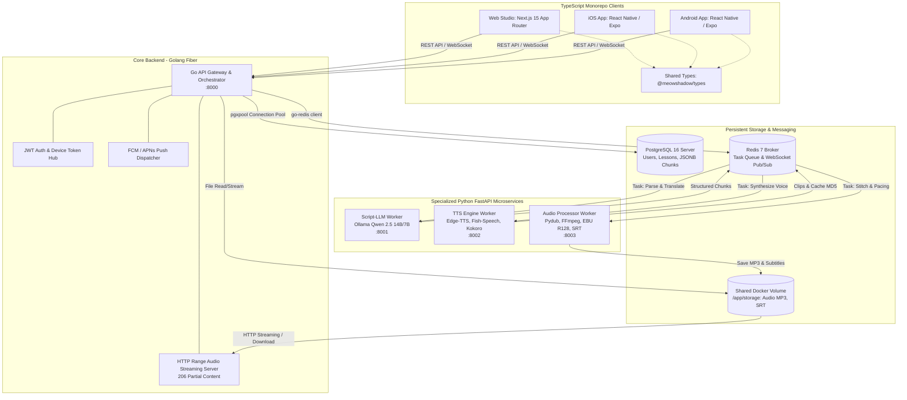

# KIẾN TRÚC HỆ THỐNG & CƠ SỞ DỮ LIỆU (SYSTEM ARCHITECTURE & DATABASE)
## DỰ ÁN: MEOWSHADOW LAB (MSL-ARCH)
### KIẾN TRÚC POLYGLOT MICROSERVICES, GOLANG CORE, PYTHON AI & POSTGRESQL

---

| Thông Tin Tài Liệu | Chi Tiết |
| :--- | :--- |
| **Mã tài liệu** | `docs/2_ARCHITECTURE_TECHSTACK.md` |
| **Phiên bản** | 3.1.0 |
| **Mô hình kiến trúc** | **Polyglot Microservices Monorepo** |
| **Cơ sở dữ liệu chính** | **PostgreSQL 16+ (pgx/v5 Connection Pool, GIN Index JSONB)** |
| **Message Broker & Cache** | **Redis 7 (Streams / Pub-Sub)** |
| **Mobile Local DB** | **Expo SQLite / OP-SQLite (Offline Storage & Sync)** |
| **Tài liệu tham chiếu** | [1_SRS.md](./1_SRS.md) |

---

## 1. SƠ ĐỒ TỔNG THỂ HỆ THỐNG (END-TO-END SYSTEM DIAGRAM)



---

## 2. PHÂN RÃ VI DỊCH VỤ & NGĂN XẾP CÔNG NGHỆ (TECH STACK MATRIX)

### 2.1. Bảng Trách Nhiệm Từng Dịch Vụ

| Tên Dịch Vụ | Ngôn Ngữ & Framework | Cổng Docker | Vai Trò & Chức Năng Cốt Lõi |
| :--- | :--- | :---: | :--- |
| **`apps/web`** | **Next.js 15, TypeScript, Tailwind** | `3000` | Giao diện Web Studio, Soạn thảo kịch bản, Karaoke Transcript player, Waveform visualizer. |
| **`apps/mobile`** | **React Native / Expo (TypeScript)** | `-` | Mobile App iOS/Android, Background Audio, Lock-screen player, Offline storage. |
| **`services/gateway-core`** | **Golang (Fiber / Gin)** | `8000` | API Gateway, Quản lý Auth, WebSocket Hub, HTTP Range Audio Streaming, Orchestrator. |
| **`services/script-llm`** | **Python (FastAPI, Ollama SDK)** | `8001` | Regex Parser bóc tách thẻ `[VI]`, `[EN]`, `[JA]`, tích hợp Ollama Qwen 2.5 phân đoạn và dịch. |
| **`services/tts-engine`** | **Python (FastAPI, PyTorch MPS)** | `8002` | Tổng hợp giọng nói song song (`edge-tts`, `Fish-Speech`, `Kokoro`), Smart Cache MD5. |
| **`services/audio-processor`** | **Python (FastAPI, Pydub, FFmpeg)** | `8003` | Chèn khoảng lặng pacing, ghép nối clip, EBU R128 (-16 LUFS), sinh timestamps SRT/VTT. |
| **`postgres-db`** | **PostgreSQL 16 Alpine** | `5432` | Lưu trữ trung tâm (Users, Lessons, JSONB Chunks & Timestamps). |
| **`redis-broker`** | **Redis 7 Alpine** | `6379` | Message broker phân phối Job Queue và kênh Pub/Sub cho WebSocket Realtime. |

---

## 3. KIẾN TRÚC CƠ SỞ DỮ LIỆU TOÀN DIỆN (DATABASE ARCHITECTURE)

### 3.1. Chiến Lược Kết Nối & Data Access Layer
1. **Golang Gateway $\rightarrow$ PostgreSQL 16 (với pgvector):**
   - **Giao thức:** TCP Binary Protocol.
   - **Driver:** **`jackc/pgx/v5` (`pgxpool`)** — Driver Go nhanh nhất thế giới, quản lý Connection Pool tự động, chống rò rỉ bộ nhớ khi tải cao.
   - **Type-Safe Query Layer:** Sử dụng **`sqlc`** để biên dịch SQL thuần túy sang Go code type-safe 100%, không runtime reflection.
   - **Cấu hình Pool tối ưu:**
     - `MaxConns = 25` (số kết nối tối đa).
     - `MinConns = 5` (kết nối mở sẵn).
     - `MaxConnLifetime = 1h` (chu kỳ làm mới kết nối).
2. **Golang Gateway $\rightarrow$ Redis 7:**
   - Sử dụng thư viện `go-redis/v9` kết nối Redis qua TCP connection pool cho Pub/Sub và Task Queue.
3. **Nguyên Tắc Decoupling cho Python Workers:**
   - Các Python Workers **hoàn toàn không cần kết nối trực tiếp vào PostgreSQL**.
   - Workers chỉ nhận Job từ Redis và trả kết quả về Redis. Go Gateway đóng vai trò duy nhất cập nhật kết quả vào PostgreSQL.

### 3.2. Quản Lý Migration & Dữ Liệu (Modern Database Lifecycle)
* **Migration Engine:** Sử dụng **Goose** (`ghcr.io/pressly/goose`) quản lý versioned migrations dạng `-- +goose Up` và `-- +goose Down` tại `services/gateway-core/db/migrations/`.
* **Data Seeding:** Tách bạch dữ liệu mẫu thử nghiệm tại `services/gateway-core/db/seeds/` (`make db-seed`).
* **Web Admin Studio:** Tích hợp **Adminer** (cổng `8080`) trực tiếp trong `docker-compose.yml` phục vụ inspect nhanh JSONB và mốc karaoke.
* **AI Semantic Search:** Tích hợp extension **`pgvector`** (`vector(1536)`) cho phép tìm kiếm ngữ nghĩa bài học và câu thoại trực tiếp trong PostgreSQL.

### 3.3. Thiết Kế Bảng Dữ Liệu PostgreSQL (Schema với JSONB & pgvector)

```sql
-- Enable UUID & Vector extensions
CREATE EXTENSION IF NOT EXISTS "pgcrypto";
CREATE EXTENSION IF NOT EXISTS "vector";

-- 1. Users & Devices tables
CREATE TABLE users (
    id UUID PRIMARY KEY DEFAULT gen_random_uuid(),
    email VARCHAR(255) UNIQUE NOT NULL,
    password_hash VARCHAR(255) NOT NULL,
    full_name VARCHAR(100),
    created_at TIMESTAMP WITH TIME ZONE DEFAULT CURRENT_TIMESTAMP,
    updated_at TIMESTAMP WITH TIME ZONE DEFAULT CURRENT_TIMESTAMP
);

CREATE TABLE user_devices (
    id UUID PRIMARY KEY DEFAULT gen_random_uuid(),
    user_id UUID REFERENCES users(id) ON DELETE CASCADE,
    device_type VARCHAR(20) NOT NULL, -- 'ios' | 'android' | 'web'
    push_token TEXT NOT NULL,
    updated_at TIMESTAMP WITH TIME ZONE DEFAULT CURRENT_TIMESTAMP,
    UNIQUE(user_id, push_token)
);

-- 2. Lessons table
CREATE TABLE lessons (
    id UUID PRIMARY KEY DEFAULT gen_random_uuid(),
    user_id UUID REFERENCES users(id) ON DELETE SET NULL,
    title VARCHAR(255) NOT NULL,
    target_language VARCHAR(10) NOT NULL, -- 'en' | 'ja'
    source_language VARCHAR(10) DEFAULT 'vi',
    total_words INT DEFAULT 0,
    duration_sec NUMERIC(6, 2) DEFAULT 0.0,
    
    -- Applied pacing configuration
    pacing_config JSONB NOT NULL,
    
    -- Sentence chunks, language tags, and karaoke timestamps
    transcript_chunks JSONB NOT NULL,
    
    -- MP3 audio & SRT subtitle file paths
    audio_file_path TEXT NOT NULL,
    srt_file_path TEXT NOT NULL,
    
    -- AI Embedding Vector (1536 dimensions)
    embedding vector(1536),
    
    created_at TIMESTAMP WITH TIME ZONE DEFAULT CURRENT_TIMESTAMP,
    updated_at TIMESTAMP WITH TIME ZONE DEFAULT CURRENT_TIMESTAMP
);

-- GIN index for script search & HNSW index for vector cosine distance
CREATE INDEX idx_lessons_chunks ON lessons USING gin (transcript_chunks);
CREATE INDEX idx_lessons_user ON lessons (user_id);
CREATE INDEX idx_lessons_embedding ON lessons USING hnsw (embedding vector_cosine_ops);

-- 3. Learning & Shadowing Progress table
CREATE TABLE learning_progress (
    id UUID PRIMARY KEY DEFAULT gen_random_uuid(),
    user_id UUID REFERENCES users(id) ON DELETE CASCADE,
    lesson_id UUID REFERENCES lessons(id) ON DELETE CASCADE,
    playback_offset_sec NUMERIC(6, 2) DEFAULT 0.0,
    shadowing_repeat_count INT DEFAULT 0,
    is_completed BOOLEAN DEFAULT FALSE,
    version INT DEFAULT 1, -- Revision counter for SQLite offline sync
    last_listened_at TIMESTAMP WITH TIME ZONE DEFAULT CURRENT_TIMESTAMP,
    updated_at TIMESTAMP WITH TIME ZONE DEFAULT CURRENT_TIMESTAMP,
    UNIQUE(user_id, lesson_id)
);
```

### 3.4. Cơ Sở Dữ Liệu Cục Bộ Trên Mobile Client (Expo SQLite / OP-SQLite)
Mobile App lưu trữ một SQLite Database nội bộ trên điện thoại để phục vụ chế độ **Offline Listening**:
* **Bảng `local_lessons`:** Lưu metadata bài học, đường dẫn file audio cục bộ (`file:///.../lesson_1.mp3`) và file phụ đề (`file:///.../lesson_1.srt`).
* **Bảng `offline_progress`:** Lưu vị trí đang nghe dở và số lần nhại câu khi không có mạng; tự động đồng bộ (sync) lên server PostgreSQL khi có kết nối Internet thông qua trường `version` và `updated_at`.

---

## 4. CẤU TRÚC MONOREPO TOÀN DỰ ÁN (ENTERPRISE PRODUCTION-GRADE)

Dưới đây là sơ đồ cấu trúc thư mục chi tiết, chuẩn mực công nghiệp (Standard Go Layout, FastAPI Clean Architecture, Next.js 15 App Router, Expo Clean Architecture, Turborepo & Docker Multi-stage):

```text
1.MeowShadow_Lab/
├── .github/                                # CI/CD Automation & GitHub Templates
│   ├── workflows/
│   │   ├── ci.yml                          # Lint, Type-Check & Unit Tests tự động cho Go, Python, TS
│   │   ├── docker-build.yml                # Build & Push Docker Images đa nền tảng (amd64 / arm64)
│   │   └── release.yml                     # Tự động hóa tagging & changelog release
│   ├── ISSUE_TEMPLATE/
│   │   ├── bug_report.md
│   │   └── feature_request.md
│   └── PULL_REQUEST_TEMPLATE.md
│
├── .husky/                                 # Git Hooks quản lý chất lượng code trước khi commit
│   ├── pre-commit                          # Chạy lint-staged & format code tự động
│   └── commit-msg                          # Kiểm tra định dạng commit message (Conventional Commits)
│
├── deploy/                                 # Cấu hình Triển khai & Giám sát Hệ thống
│   ├── nginx/
│   │   ├── conf.d/
│   │   │   └── meowshadow.conf             # Reverse Proxy, SSL, Gzip, HTTP 206 Partial Content Stream
│   │   └── nginx.conf
│   ├── monitoring/
│   │   ├── prometheus/
│   │   │   └── prometheus.yml              # Thu thập metrics từ Go Gateway & Python Workers
│   │   └── grafana/
│   │       ├── dashboards/                 # Dashboard theo dõi CPU, RAM, TTS latency, Queue depth
│   │       └── datasources/
│   └── systemd/                            # Service templates cho VPS / Bare-metal
│
├── docs/                                   # Bộ tài liệu kỹ thuật & kiến trúc hoàn chỉnh
│   ├── README.md                           # Mục lục và định hướng tra cứu tài liệu
│   ├── 1_SRS.md                            # Yêu cầu nghiệp vụ & đặc tả kỹ thuật chi tiết
│   ├── 2_ARCHITECTURE_TECHSTACK.md         # Kiến trúc Polyglot Microservices & Database
│   ├── 3_DOCKER_CONTAINERIZATION.md        # Chuẩn hóa Docker, Multi-stage builds & Volumes
│   ├── 4_API_AND_DATA_SCHEMAS.md           # Giao kèo RESTful API, WebSocket, Error Codes & Types
│   ├── 5_SPRINT_PLAN.md                    # Lộ trình 5 Sprint triển khai chi tiết
│   ├── 6_DEVELOPMENT_GUIDE_AND_ENV.md      # Hướng dẫn setup môi trường, debug & biến môi trường
│   └── adr/                                # Architecture Decision Records (Lịch sử quyết định kỹ thuật)
│       ├── 0001_polyglot_monorepo.md
│       ├── 0002_golang_gateway_choice.md
│       └── 0003_pgvector_for_semantic_search.md
│
├── scripts/                                # Bộ Shell Scripts điều hành dự án (Automation Tooling)
│   ├── setup.sh                            # Cài đặt ban đầu: kiểm tra Docker, pnpm, ffmpeg, uv/pip
│   ├── dev.sh                              # Khởi động toàn bộ cụm dịch vụ kèm live-reload
│   ├── seed.sh                             # Nạp dữ liệu bài học và từ vựng mẫu
│   ├── migrate.sh                          # Chạy Goose Database Migration (Up/Down/Status)
│   ├── clean.sh                            # Dọn dẹp cache audio, temp files và Docker containers rác
│   └── backup_db.sh                        # Sao lưu dữ liệu PostgreSQL tự động
│
├── storage/                                # Docker Shared Volume lưu trữ Media & Phụ đề
│   ├── README.md                           # Hướng dẫn cấu trúc phân cấp và quyền truy cập
│   ├── audio/                              # File MP3 bài học 10 phút hoàn chỉnh (VD: lesson_<uuid>.mp3)
│   ├── subtitles/                          # File phụ đề đồng bộ (VD: lesson_<uuid>.srt, .vtt)
│   ├── cache/                              # Cache từng câu thoại MD5 băm: <md5_hash>.mp3
│   ├── cues/                               # Hiệu ứng âm thanh chime, beep báo chuyển câu
│   └── temp/                               # Thư mục xử lý tạm thời cho FFmpeg, tự động dọn sau khi render
│
├── apps/                                   # Các ứng dụng người dùng cuối (User-Facing Applications)
│   │
│   ├── web/                                # Next.js 15+ Web Studio (App Router, Tailwind CSS, TypeScript)
│   │   ├── public/                         # Static assets (favicons, icons, logo, sound cues)
│   │   ├── src/
│   │   │   ├── app/                        # Next.js App Router (File-based Routing)
│   │   │   │   ├── (auth)/                 # Nhóm trang xác thực (Login, Register, Forgot Password)
│   │   │   │   │   ├── login/page.tsx
│   │   │   │   │   ├── register/page.tsx
│   │   │   │   │   └── layout.tsx
│   │   │   │   ├── (dashboard)/            # Giao diện chính Studio & Quản lý bài học
│   │   │   │   │   ├── studio/             # Studio Soạn thảo & Tạo Audio
│   │   │   │   │   │   └── page.tsx
│   │   │   │   │   ├── lessons/            # Thư viện bài học
│   │   │   │   │   │   ├── page.tsx        # Danh sách bài học (Table / Grid)
│   │   │   │   │   │   └── [id]/page.tsx   # Chi tiết bài học & Karaoke Interactive Player
│   │   │   │   │   ├── settings/page.tsx   # Cài đặt giọng đọc mặc định, API keys, pacing presets
│   │   │   │   │   ├── layout.tsx          # Sidebar + Top Navbar persistent layout
│   │   │   │   │   └── page.tsx            # Tổng quan Dashboard & Thống kê luyện tập
│   │   │   │   ├── api/                    # Next.js BFF Route Handlers (Proxy / Health check)
│   │   │   │   ├── layout.tsx              # Root Layout (Theme, Providers, Font definitions)
│   │   │   │   ├── error.tsx               # Error Boundary UI
│   │   │   │   ├── not-found.tsx           # Trang 404 tùy biến
│   │   │   │   └── globals.css             # Tailwind Directives & Custom Design Tokens
│   │   │   ├── components/                 # Component UI tái sử dụng
│   │   │   │   ├── ui/                     # Primitives components (Button, Modal, Slider, Tabs, Toast)
│   │   │   │   ├── studio/                 # Components riêng của Studio
│   │   │   │   │   ├── ScriptEditor.tsx    # Bảng soạn thảo hỗ trợ thẻ [VI], [EN], [JA]
│   │   │   │   │   ├── PacingControl.tsx   # Thanh trượt điều chỉnh khoảng lặng 1.5s / 3.5s
│   │   │   │   │   ├── VoiceSelector.tsx   # Chọn giọng đọc Nam / Nữ kèm audio preview
│   │   │   │   │   └── ProgressModal.tsx   # Modal hiển thị tiến trình WebSocket thời gian thực
│   │   │   │   ├── player/                 # Trình phát âm thanh & Karaoke
│   │   │   │   │   ├── KaraokePlayer.tsx   # Auto-scroll, highlight câu đang phát
│   │   │   │   │   ├── Waveform.tsx        # Trực quan hóa sóng âm thanh (Wavesurfer)
│   │   │   │   │   ├── PlaybackBar.tsx     # Điều khiển Play/Pause, tua ±5s, tốc độ 0.75x-1.5x
│   │   │   │   │   └── RepeatBadge.tsx     # Đếm số lần lặp lại câu (Shadowing Counter)
│   │   │   │   ├── lessons/                # Components quản lý bài học (Card, Filter, DeleteModal)
│   │   │   │   └── common/                 # Header, Sidebar, ThemeToggle, WebSocketIndicator
│   │   │   ├── hooks/                      # Custom React Hooks
│   │   │   │   ├── useAudioPlayer.ts       # Hook điều khiển Audio HTML5 & đồng bộ timeupdate
│   │   │   │   ├── useKaraokeSync.ts       # Hook tính toán câu đang nói dựa trên mốc giây
│   │   │   │   ├── useWebSocketProgress.ts # Hook lắng nghe Socket tiến độ render
│   │   │   │   └── useDebounce.ts
│   │   │   ├── stores/                     # State Management toàn cục (Zustand)
│   │   │   │   ├── usePlayerStore.ts       # Trạng thái audio, volume, tốc độ, câu hiện tại
│   │   │   │   ├── useStudioStore.ts       # Nội dung kịch bản, cấu hình pacing đang soạn
│   │   │   │   └── useAuthStore.ts         # User session & Access Token
│   │   │   └── lib/                        # Tiện ích bổ trợ (Utilities)
│   │   │       ├── api.ts                  # Instance gọi API (tích hợp @meowshadow/api-client)
│   │   │       ├── utils.ts                # Format thời gian (00:00), format dung lượng
│   │   │       └── constants.ts
│   │   ├── Dockerfile                      # Multi-stage build tối ưu Next.js Standalone
│   │   ├── next.config.ts
│   │   ├── tailwind.config.ts
│   │   ├── tsconfig.json
│   │   └── package.json
│   │
│   └── mobile/                             # React Native / Expo Mobile App (iOS & Android)
│       ├── assets/                         # Splash screen, App icon, Sound effects, Local fonts
│       ├── src/
│       │   ├── app/                        # Expo Router Navigation
│       │   │   ├── (auth)/                 # Màn hình Đăng nhập / Đăng ký
│       │   │   ├── (tabs)/                 # Tab Navigation chính
│       │   │   │   ├── index.tsx           # Thư viện bài học (Home)
│       │   │   │   ├── player.tsx          # Màn hình phát audio đầy đủ (Full Player)
│       │   │   │   ├── downloads.tsx       # Quản lý bài học đã tải về (Offline Storage)
│       │   │   │   └── profile.tsx         # Cài đặt tài khoản & Đồng bộ dữ liệu
│       │   │   ├── lesson/
│       │   │   │   └── [id].tsx            # Chi tiết bài học
│       │   │   └── _layout.tsx             # Root Navigation Container & Theme Provider
│       │   ├── components/                 # Mobile UI Components
│       │   │   ├── player/
│       │   │   │   ├── MiniPlayer.tsx      # Thanh player thu nhỏ ghim đáy màn hình
│       │   │   │   ├── KaraokeView.tsx     # Danh sách cuộn chữ to, dễ đọc khi di chuyển
│       │   │   │   └── AudioControls.tsx   # Nút Play/Pause lớn, nút lặp lại 1 câu
│       │   │   ├── lessons/                # LessonListItem, DownloadProgressIndicator
│       │   │   └── ui/                     # Nút bấm, typography, thẻ bài học chuẩn Native
│       │   ├── services/                   # Nền tảng dịch vụ cốt lõi của Mobile
│       │   │   ├── audio/
│       │   │   │   ├── BackgroundAudio.ts  # Phát nhạc nền khi tắt màn hình (Audio Focus / Lockscreen)
│       │   │   │   └── NotificationSync.ts # Điều khiển trình phát qua Lock-screen / Control Center
│       │   │   ├── database/               # SQLite cục bộ trên máy (OP-SQLite / Expo SQLite)
│       │   │   │   ├── sqlite.ts           # Khởi tạo kết nối SQLite nội bộ
│       │   │   │   ├── migrations.ts       # Tạo bảng local_lessons & offline_progress
│       │   │   │   └── progressRepo.ts     # Lưu và đọc tiến trình nghe offline
│       │   │   └── sync/
│       │   │       └── offlineSync.ts      # Engine tự động đẩy tiến trình lên server khi có mạng
│       │   ├── stores/                     # Zustand stores cho Mobile
│       │   ├── hooks/                      # Custom hooks cho Audio, Battery, Network
│       │   └── theme/                      # Màu sắc, font size tối ưu cho Mobile Dark Mode
│       ├── app.json                        # Cấu hình Expo, Permissions (Background Audio, Storage)
│       ├── babel.config.js
│       ├── tsconfig.json
│       └── package.json
│
├── packages/                               # Thư viện nội bộ dùng chung Monorepo (Shared Packages)
│   │
│   ├── shared-types/                       # TypeScript Interface & Enums (@meowshadow/types)
│   │   ├── src/
│   │   │   ├── index.ts                    # Entrypoint export toàn bộ kiểu dữ liệu
│   │   │   ├── auth.ts                     # UserProfile, AuthSession, DeviceToken
│   │   │   ├── lesson.ts                   # LessonItem, SubtitleTimestamp, LearningProgress
│   │   │   ├── script.ts                   # ScriptChunk, PacingConfig, SupportedLanguage
│   │   │   ├── audio.ts                    # AudioGenerateRequest, TTSEngineType
│   │   │   ├── websocket.ts                # TaskProgressEvent, TaskStatus
│   │   │   └── api.ts                      # ApiResponse, ApiErrorDetail
│   │   ├── package.json
│   │   └── tsconfig.json
│   │
│   ├── api-client/                         # SDK API Client dùng chung cho Web & Mobile (@meowshadow/api-client)
│   │   ├── src/
│   │   │   ├── index.ts
│   │   │   ├── client.ts                   # Cấu hình Axios / Fetch Base với Interceptors
│   │   │   ├── authApi.ts                  # Hàm gọi /api/v1/auth/* (login, refresh, me)
│   │   │   ├── lessonsApi.ts               # Hàm gọi /api/v1/lessons/*
│   │   │   ├── audioApi.ts                 # Hàm gọi /api/v1/audio/*
│   │   │   ├── wsClient.ts                 # Trình bao bọc WebSocket tự động reconnect
│   │   │   └── errors.ts                   # Chuẩn hóa lỗi API
│   │   ├── package.json
│   │   └── tsconfig.json
│   │
│   ├── eslint-config/                      # Cấu hình ESLint chuẩn mực cho toàn bộ Monorepo
│   │   ├── base.js
│   │   ├── react.js
│   │   └── package.json
│   │
│   └── tsconfig/                           # Base tsconfig kế thừa cho các packages & apps
│       ├── base.json
│       ├── nextjs.json
│       ├── react-native.json
│       └── package.json
│
├── services/                               # Các Vi Dịch Vụ Phía Sau (Microservices Backend)
│   │
│   ├── gateway-core/                       # Golang API Gateway & Streaming Server (Clean Architecture)
│   │   ├── cmd/
│   │   │   ├── server/
│   │   │   │   └── main.go                 # Entrypoint khởi động HTTP Server & WebSocket Hub
│   │   │   └── cli/                        # Công cụ dòng lệnh hỗ trợ bảo trì dữ liệu
│   │   ├── config/
│   │   │   └── config.go                   # Đọc biến môi trường (Database, Redis, JWT, Storage)
│   │   ├── internal/                       # Code nội bộ bảo vệ theo chuẩn Go (Private Package)
│   │   │   ├── domain/                     # Entities & Business Interfaces thuần túy
│   │   │   │   ├── user.go
│   │   │   │   ├── lesson.go
│   │   │   │   ├── progress.go
│   │   │   │   └── task.go
│   │   │   ├── usecase/                    # Business Logic Layer (Use Cases & Orchestration)
│   │   │   │   ├── auth_usecase.go         # Đăng ký, đăng nhập, cấp phát JWT
│   │   │   │   ├── lesson_usecase.go       # Quản lý thư viện bài học, tìm kiếm ngữ nghĩa
│   │   │   │   ├── orchestrator_usecase.go # Điều phối quy trình tạo audio qua Redis Streams
│   │   │   │   ├── streaming_usecase.go    # Xử lý HTTP Range Byte-serving cho Audio
│   │   │   │   └── sync_usecase.go         # Đồng bộ tiến trình Offline từ Client
│   │   │   ├── delivery/                   # Entrypoints & Transport Adapters
│   │   │   │   ├── http/                   # RESTful API Controllers (Fiber / Gin)
│   │   │   │   │   ├── router.go           # Đăng ký danh mục routes API
│   │   │   │   │   ├── auth_handler.go
│   │   │   │   │   ├── lesson_handler.go
│   │   │   │   │   ├── script_handler.go
│   │   │   │   │   └── stream_handler.go   # HTTP 206 Partial Content Streamer
│   │   │   │   ├── ws/                     # WebSocket Manager
│   │   │   │   │   ├── hub.go              # Quản lý kết nối Client & kênh Broadcast
│   │   │   │   │   ├── client.go           # Đọc/ghi Socket từng Client
│   │   │   │   │   └── progress_handler.go # Đẩy % tiến độ render về UI
│   │   │   │   └── middleware/             # HTTP Middlewares
│   │   │   │       ├── jwt_auth.go         # Kiểm tra tính hợp lệ của Access Token
│   │   │   │       ├── rate_limiter.go     # Giới hạn tần suất request (chống spam)
│   │   │   │       ├── logger.go           # Ghi log request có định dạng
│   │   │   │       ├── cors.go
│   │   │   │       └── recover.go          # Bắt Panic, chống sập server
│   │   │   ├── repository/                 # Data Access Implementation
│   │   │   │   ├── postgres/               # Truy vấn PostgreSQL thông qua SQLC & pgxpool
│   │   │   │   │   ├── db/                 # Generated code từ SQLC
│   │   │   │   │   │   ├── db.go
│   │   │   │   │   │   ├── models.go
│   │   │   │   │   │   ├── lessons.sql.go
│   │   │   │   │   │   └── users.sql.go
│   │   │   │   │   ├── connection.go       # Quản lý kết nối pgxpool (MaxConns=25)
│   │   │   │   │   ├── lesson_repo.go
│   │   │   │   │   └── user_repo.go
│   │   │   │   ├── redis/                  # Giao tiếp Redis 7
│   │   │   │   │   ├── connection.go       # Kết nối go-redis
│   │   │   │   │   ├── task_publisher.go   # Đẩy Task vào Queue / Streams
│   │   │   │   │   └── progress_sub.go     # Lắng nghe cập nhật tiến độ từ Python Workers
│   │   │   │   └── storage/                # Thao tác đọc/ghi File Storage cục bộ
│   │   │   │       └── file_storage.go
│   │   │   └── client/                     # Tích hợp dịch vụ bên ngoài
│   │   │       └── notification/           # Gửi Push Notification (FCM / APNs)
│   │   │           └── push_dispatcher.go
│   │   ├── pkg/                            # Thư viện dùng chung có thể tái sử dụng (Public)
│   │   │   ├── logger/                     # Slog / Zap Structured Logger
│   │   │   ├── response/                   # Format Response JSON chuẩn (Success / Error)
│   │   │   ├── jwt/                        # Utility tạo và xác minh JSON Web Token
│   │   │   └── audioutil/                  # Tiện ích phân tích HTTP Range header
│   │   ├── db/                             # Cơ sở dữ liệu & Migration Assets
│   │   │   ├── migrations/                 # Goose SQL Versioned Migrations
│   │   │   │   ├── 00001_init_extensions.sql
│   │   │   │   ├── 00002_create_users_tables.sql
│   │   │   │   ├── 00003_create_lessons_tables.sql
│   │   │   │   └── 00004_create_progress_tables.sql
│   │   │   ├── queries/                    # SQL Queries thuần túy phục vụ SQLC
│   │   │   │   ├── lessons.sql
│   │   │   │   └── users.sql
│   │   │   └── seeds/                      # Dữ liệu mẫu (Sample data)
│   │   │       └── 00001_dev_seed.sql
│   │   ├── Dockerfile                      # Multi-stage Go Binary Container
│   │   ├── Dockerfile.migration            # Container chuyên biệt chạy Goose Migrations
│   │   ├── sqlc.yaml                       # Cấu hình SQLC sinh code
│   │   ├── go.mod
│   │   └── go.sum
│   │
│   ├── script-llm/                         # Python Worker: Bóc tách cú pháp & Tích hợp LLM
│   │   ├── src/
│   │   │   ├── main.py                     # Khởi tạo FastAPI App & Lifespan
│   │   │   ├── config.py                   # Pydantic Settings (Ollama URL, Redis Addr)
│   │   │   ├── api/                        # HTTP Endpoints (cho direct call nếu cần)
│   │   │   │   ├── v1/
│   │   │   │   │   ├── endpoints/
│   │   │   │   │   │   ├── parse.py        # Endpoint bóc tách thẻ [VI], [EN], [JA]
│   │   │   │   │   │   ├── translate.py    # Endpoint dịch thuật qua Ollama
│   │   │   │   │   │   └── health.py
│   │   │   │   │   └── router.py
│   │   │   │   └── deps.py
│   │   │   ├── core/                       # Custom Logger & Exception Handlers
│   │   │   ├── services/                   # Logic nghiệp vụ xử lý văn bản
│   │   │   │   ├── tag_parser.py           # Regex Engine bóc tách nhãn ngôn ngữ
│   │   │   │   ├── chunker.py              # Thuật toán gom nhóm 3–4 câu Shadowing
│   │   │   │   └── ollama_client.py        # Driver giao tiếp Ollama Qwen 2.5 (14B/7B)
│   │   │   ├── workers/                    # Redis Task Consumer (Chạy nền)
│   │   │   │   ├── consumer.py             # Lắng nghe job từ Redis Queue
│   │   │   │   └── task_handlers.py        # Thực thi parse & publish kết quả
│   │   │   └── schemas/                    # Pydantic Schemas (Validation Models)
│   │   │       ├── parse_request.py
│   │   │       └── script_response.py
│   │   ├── tests/                          # Pytest Unit & Integration tests
│   │   │   ├── test_tag_parser.py
│   │   │   └── test_chunker.py
│   │   ├── Dockerfile
│   │   ├── requirements.txt
│   │   └── pyproject.toml
│   │
│   ├── tts-engine/                         # Python Worker: Tổng hợp Giọng nói Đa Nền tảng
│   │   ├── src/
│   │   │   ├── main.py
│   │   │   ├── config.py
│   │   │   ├── api/v1/
│   │   │   │   ├── endpoints/
│   │   │   │   │   ├── synthesize.py       # Endpoint tạo tiếng trực tiếp
│   │   │   │   │   ├── voices.py           # Danh sách các giọng đọc hỗ trợ
│   │   │   │   │   └── health.py
│   │   │   │   └── router.py
│   │   │   ├── engines/                    # Strategy Pattern cho các Engine TTS
│   │   │   │   ├── base.py                 # Lớp trừu tượng BaseTTSEngine
│   │   │   │   ├── edge_tts_engine.py      # Microsoft Edge TTS (Async, Đa ngữ)
│   │   │   │   ├── kokoro_engine.py        # Kokoro 82M Local Neural TTS
│   │   │   │   ├── fish_speech_engine.py   # Fish-Speech Zero-shot Voice Clone
│   │   │   │   └── factory.py              # Bộ chọn Engine theo cấu hình yêu cầu
│   │   │   ├── services/
│   │   │   │   ├── cache_service.py        # Quản lý Cache MD5 clips âm thanh
│   │   │   │   └── batch_synthesizer.py    # Xử lý tổng hợp song song (asyncio.gather)
│   │   │   ├── workers/                    # Redis Task Consumer
│   │   │   │   ├── consumer.py
│   │   │   │   └── tts_worker.py           # Nhận danh sách chunks, render và báo % tiến độ
│   │   │   └── schemas/
│   │   │       ├── tts_request.py
│   │   │       └── voice_metadata.py
│   │   ├── tests/
│   │   │   └── test_edge_tts.py
│   │   ├── Dockerfile
│   │   ├── requirements.txt
│   │   └── pyproject.toml
│   │
│   └── audio-processor/                    # Python Worker: Cắt ghép, Chèn Pacing & Master Audio
│       ├── src/
│       │   ├── main.py
│       │   ├── config.py
│       │   ├── api/v1/
│       │   │   ├── endpoints/
│       │   │   │   ├── process.py
│       │   │   │   └── health.py
│       │   │   └── router.py
│       │   ├── services/                   # Logic kỹ thuật âm thanh (FFmpeg & Pydub)
│       │   │   ├── silence_generator.py    # Tạo khoảng lặng digital 1.5s, 3.5s, 0.5s chuẩn xác
│       │   │   ├── pacing_builder.py       # Xếp chuỗi: Câu VI -> Lặng 1.5s -> Câu EN -> Lặng 3.5s
│       │   │   ├── audio_master.py         # Ghép clips, Fade In/Out, Chuẩn hóa EBU R128 (-16 LUFS)
│       │   │   └── subtitle_engine.py      # Đo thời lượng thực tế của từng clip, sinh file .srt & .vtt
│       │   ├── workers/                    # Redis Task Consumer
│       │   │   ├── consumer.py
│       │   │   └── audio_worker.py         # Nhận audio clips, tạo bài học 10 phút, lưu storage
│       │   └── schemas/
│       │       └── process_request.py
│       ├── tests/
│       │   ├── test_silence.py
│       │   └── test_subtitles.py
│       ├── Dockerfile
│       ├── requirements.txt
│       └── pyproject.toml
│
├── .dockerignore                           # Loại bỏ file thừa khi build Docker context
├── .env.example                            # Bản mẫu toàn bộ biến môi trường của dự án
├── .gitignore                              # Git ignore chuẩn hóa cho Node, Go, Python, OS
├── docker-compose.yml                      # Điều phối Container môi trường phát triển (Local Dev)
├── docker-compose.prod.yml                 # Điều phối Container môi trường Production
├── Makefile                                # Bộ phím tắt điều khiển 1-click toàn dự án
├── package.json                            # Root Workspace Scripts & Turbo orchestration
├── pnpm-lock.yaml                          # Lockfile thống nhất cho toàn bộ Monorepo
├── pnpm-workspace.yaml                     # Khai báo Monorepo packages: apps/*, packages/*
├── turbo.json                              # Cấu hình Turborepo Pipeline Caching
└── README.md                               # Hướng dẫn khởi chạy tổng quan dự án
```

---

## 5. HỆ THỐNG CẨM NANG KỸ THUẬT PHÂN TẦNG (LOCALIZED RUNBOOKS)

Để tránh phình to tài liệu kiến trúc chung, chi tiết triển khai cụ thể của từng phân hệ được phân bổ về các file `README.md` chuyên trách đặt trực tiếp trong từng thư mục mã nguồn:

* **Backend Services:**
  - [services/gateway-core/README.md](../services/gateway-core/README.md): Go Clean Architecture, `pgxpool`, `sqlc`, HTTP 206 Streaming, WebSocket Hub.
  - [services/script-llm/README.md](../services/script-llm/README.md): FastAPI, Regex Tag Parser (`[VI]`, `[EN]`, `[JA]`), Ollama Qwen 2.5 Driver.
  - [services/tts-engine/README.md](../services/tts-engine/README.md): Strategy Pattern (Edge-TTS, Kokoro, Fish-Speech), Smart Cache MD5, Async Batching.
  - [services/audio-processor/README.md](../services/audio-processor/README.md): Pacing Silence (1.5s/3.5s), Mastering EBU R128 (-16 LUFS), Subtitle Engine.
* **Client Applications:**
  - [apps/web/README.md](../apps/web/README.md): Next.js 15 App Router, Zustand, Interactive Karaoke Player, Waveform Visualizer.
  - [apps/mobile/README.md](../apps/mobile/README.md): React Native / Expo, Background Audio, Lockscreen Controls, SQLite Offline Sync.
* **Shared Libraries & Storage:**
  - [packages/shared-types/README.md](../packages/shared-types/README.md): TypeScript Interfaces `@meowshadow/types`, Single Source of Truth.
  - [packages/api-client/README.md](../packages/api-client/README.md): SDK API Client, Silent Token Refresh, WebSocket Wrapper.
  - [storage/README.md](../storage/README.md): Cấu trúc 5 thư mục con (`audio/`, `subtitles/`, `cache/`, `cues/`, `temp/`) & Phân quyền.


