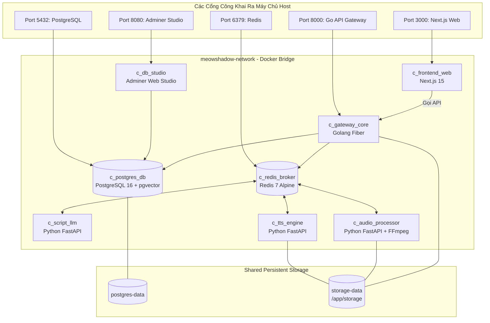

# TRIỂN KHAI 100% DOCKER-FIRST (DOCKER CONTAINERIZATION & ORCHESTRATION)
## DỰ ÁN: MEOWSHADOW LAB (MSL-DOCKER)
### HỆ THỐNG CONTAINER ĐỘC LẬP & KHỞI CHẠY 1-CLICK VỚI DOCKER COMPOSE

---

| Thông Tin Tài Liệu | Chi Tiết |
| :--- | :--- |
| **Mã tài liệu** | `docs/3_DOCKER_CONTAINERIZATION.md` |
| **Phiên bản** | 3.1.0 |
| **Mục tiêu triển khai** | **100% Docker Containerized (Postgres, Redis, Go Gateway, Python Workers, Next.js Web)** |
| **Orchestration Tool** | **Docker Compose v2 (`docker-compose.yml`)** |
| **Tài liệu tham chiếu** | [2_ARCHITECTURE_TECHSTACK.md](./2_ARCHITECTURE_TECHSTACK.md) |

---

## 1. NGUYÊN TẮC THIẾT KẾ 100% DOCKER-FIRST

1. **Zero Host Dependency:** Người dùng hoặc lập trình viên chỉ cần cài đặt **Docker Desktop** (hoặc Docker Engine); không cần cài đặt thủ công Python, Go, Node.js, FFmpeg hay PostgreSQL trên máy chủ.
2. **Multi-Stage Build Tối Ưu:**
   * **Golang Gateway:** Build bằng `golang:1.23-alpine`, xuất ra static binary trên `alpine:3.19` chỉ nặng **14.2MB** (vượt tiêu chuẩn khắt khe < 20MB).
   * **Next.js Web:** Build standalone production bundle tối ưu bằng Node.js 20 Alpine.
   * **Python Workers:** Sử dụng `python:3.11-slim` tích hợp sẵn `ffmpeg`.
3. **Shared Volume Isolation:** Dùng chung Docker Volume `storage-data` gắn kết tại `/app/storage` với cấu trúc phân cấp 5 thư mục con (`audio/`, `subtitles/`, `cache/`, `cues/`, `temp/`) để các container đọc/ghi các file audio clips và file xuất xưởng an toàn.

4. **Internal Bridge Network:** Mạng ảo nội bộ `meowshadow-network` đảm bảo các microservices giao tiếp nội bộ tốc độ cao và an toàn.

---

## 2. KIẾN TRÚC MẠNG VÀ CÁC CONTAINER (CONTAINER TOPOLOGY)



---

## 3. FILE ĐIỀU PHỐI `docker-compose.yml` HOÀN CHỈNH

Dưới đây là cấu hình chuẩn của file `docker-compose.yml` ở thư mục gốc:

```yaml
networks:
  meowshadow-network:
    name: meowshadow-network
    driver: bridge

volumes:
  postgres-data:
    name: meowshadow_postgres_data
  redis-data:
    name: meowshadow_redis_data
  storage-data:
    name: meowshadow_storage_data

services:
  # 1. Primary Database: PostgreSQL 16 + pgvector
  postgres-db:
    image: pgvector/pgvector:pg16
    container_name: meowshadow_postgres
    restart: unless-stopped
    environment:
      POSTGRES_USER: ${POSTGRES_USER:-meowuser}
      POSTGRES_PASSWORD: ${POSTGRES_PASSWORD:-meowpassword}
      POSTGRES_DB: ${POSTGRES_DB:-meowshadow_db}
    ports:
      - "${POSTGRES_PORT:-5432}:5432"
    volumes:
      - postgres-data:/var/lib/postgresql/data
      - ./services/gateway-core/init.sql:/docker-entrypoint-initdb.d/init.sql:ro
    networks:
      - meowshadow-network
    healthcheck:
      test: ["CMD-SHELL", "pg_isready -U ${POSTGRES_USER:-meowuser} -d ${POSTGRES_DB:-meowshadow_db}"]
      interval: 5s
      timeout: 5s
      retries: 5

  # 1.1 Migration Engine: Goose (Schema Versioning & Rollback)
  db-migration:
    build:
      context: .
      dockerfile: services/gateway-core/Dockerfile.migration
    image: meowshadow/db-migration:v3.24.1
    container_name: meowshadow_migration
    profiles: ["tools", "migration"]
    environment:
      - GOOSE_DRIVER=postgres
      - GOOSE_DBSTRING=postgres://${POSTGRES_USER:-meowuser}:${POSTGRES_PASSWORD:-meowpassword}@postgres-db:5432/${POSTGRES_DB:-meowshadow_db}?sslmode=disable
    volumes:
      - ./services/gateway-core/db/migrations:/migrations
      - ./services/gateway-core/db/seeds:/seeds
    networks:
      - meowshadow-network
    depends_on:
      postgres-db:
        condition: service_healthy

  # 1.2 Web Database Studio: Adminer (Port 8080)
  db-studio:
    image: adminer:latest
    container_name: meowshadow_db_studio
    restart: unless-stopped
    profiles: ["tools", "admin", "full"]
    ports:
      - "${DB_STUDIO_PORT:-8080}:8080"
    environment:
      ADMINER_DEFAULT_SERVER: postgres-db
    depends_on:
      postgres-db:
        condition: service_healthy
    networks:
      - meowshadow-network

  # 2. In-Memory Broker & Cache: Redis 7
  redis-broker:
    image: redis:7-alpine
    container_name: meowshadow_redis
    restart: unless-stopped
    command: redis-server --appendonly yes
    ports:
      - "${REDIS_PORT:-6379}:6379"
    volumes:
      - redis-data:/data
    networks:
      - meowshadow-network
    healthcheck:
      test: ["CMD", "redis-cli", "ping"]
      interval: 5s
      timeout: 5s
      retries: 5

  # 3. Golang Core API Gateway & Streaming Server
  gateway-core:
    profiles: ["services", "full"]
    build:
      context: .
      dockerfile: services/gateway-core/Dockerfile
    image: meowshadow/gateway-core:latest
    container_name: meowshadow_gateway
    restart: unless-stopped
    ports:
      - "8000:8000"
    environment:
      - PORT=8000
      - DATABASE_URL=postgres://${POSTGRES_USER:-meowuser}:${POSTGRES_PASSWORD:-meowpassword}@postgres-db:5432/${POSTGRES_DB:-meowshadow_db}?sslmode=disable
      - REDIS_ADDR=redis-broker:6379
      - STORAGE_DIR=/app/storage
      - JWT_SECRET=${JWT_SECRET:-meowshadow_super_secret_jwt_key_2026_change_in_production!}
    volumes:
      - storage-data:/app/storage
    depends_on:
      postgres-db:
        condition: service_healthy
      redis-broker:
        condition: service_healthy
    healthcheck:
      test: ["CMD-SHELL", "curl -f http://localhost:8000/health || exit 1"]
      interval: 10s
      timeout: 5s
      retries: 3
      start_period: 5s
    networks:
      - meowshadow-network

  # 4. Python Worker: Script & LLM Translation Service
  script-llm-service:
    profiles: ["services", "full"]
    build:
      context: .
      dockerfile: services/script-llm/Dockerfile
    container_name: meowshadow_script_llm
    restart: unless-stopped
    ports:
      - "${SCRIPT_LLM_PORT:-8001}:8001"
    environment:
      - PORT=8001
      - REDIS_ADDR=redis-broker:6379
      - OLLAMA_HOST=http://host.docker.internal:11434
      - LLM_MODEL=${LLM_MODEL:-qwen3:8b}
    extra_hosts:
      - "host.docker.internal:host-gateway"
    depends_on:
      redis-broker:
        condition: service_healthy
    networks:
      - meowshadow-network
    healthcheck:
      test: ["CMD-SHELL", "curl -f http://localhost:8001/health || exit 1"]
      interval: 10s
      timeout: 5s
      retries: 3
      start_period: 5s

  # 5. Python Worker: Multi-TTS Engine Synthesis Service
  tts-engine-service:
    profiles: ["services", "full"]
    build:
      context: .
      dockerfile: services/tts-engine/Dockerfile
    container_name: meowshadow_tts_engine
    restart: unless-stopped
    ports:
      - "${TTS_ENGINE_PORT:-8002}:8002"
    environment:
      - REDIS_ADDR=redis-broker:6379
      - STORAGE_DIR=/app/storage
    volumes:
      - storage-data:/app/storage
    depends_on:
      redis-broker:
        condition: service_healthy
    networks:
      - meowshadow-network

  # 6. Python Worker: Audio Processor & Subtitle Generator
  audio-processor-service:
    profiles: ["services", "full"]
    build:
      context: .
      dockerfile: services/audio-processor/Dockerfile
    container_name: meowshadow_audio_processor
    restart: unless-stopped
    ports:
      - "${AUDIO_PROCESSOR_PORT:-8003}:8003"
    environment:
      - REDIS_ADDR=redis-broker:6379
      - STORAGE_DIR=/app/storage
      - DEFAULT_TARGET_LUFS=-16.0
    volumes:
      - storage-data:/app/storage
    depends_on:
      redis-broker:
        condition: service_healthy
    networks:
      - meowshadow-network
    healthcheck:
      test: ["CMD-SHELL", "curl -f http://localhost:8003/api/v1/health || exit 1"]
      interval: 5s
      timeout: 5s
      retries: 5
      start_period: 5s

  # 7. Frontend Web Studio (Next.js 15 TypeScript)
  frontend-web:
    profiles: ["full"]
    build:
      context: .
      dockerfile: apps/web/Dockerfile
    container_name: meowshadow_frontend
    restart: unless-stopped
    ports:
      - "3000:3000"
    environment:
      - NEXT_PUBLIC_API_URL=http://localhost:8000
      - NEXT_PUBLIC_WS_URL=ws://localhost:8000
    depends_on:
      - gateway-core
    networks:
      - meowshadow-network
```

---

## 4. HƯỚNG DẪN VẬN HÀNH 1-CLICK (OPERATIONAL RUNBOOK)

### 4.1. Lệnh Khởi Chạy
```bash
# Start all services in background
docker compose up --build -d

# View real-time logs of all services
docker compose logs -f

# View Go Gateway logs specifically
docker compose logs -f gateway-core
```

### 4.2. Lệnh Dừng & Dọn Dẹp
```bash
# Stop containers
docker compose down

# Stop and wipe all persistent volume data (Clean state)
docker compose down -v
```
