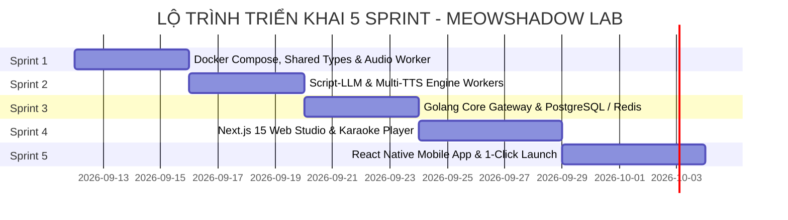

# KẾ HOẠCH TRIỂN KHAI DỰ ÁN THEO SPRINT (PROJECT SPRINT PLAN)
## DỰ ÁN: MEOWSHADOW LAB (MSL-SPRINT)
### LỘ TRÌNH 5 SPRINT: 100% DOCKER-FIRST, GOLANG GATEWAY, PYTHON WORKERS, NEXT.JS & REACT NATIVE

---

| Thông Tin Kế Hoạch | Chi Tiết |
| :--- | :--- |
| **Mã tài liệu** | `docs/5_SPRINT_PLAN.md` |
| **Phiên bản** | 3.1.0 |
| **Mô hình triển khai** | **100% Docker-First Containerization (`docker compose up -d`)** |
| **Công nghệ cốt lõi** | **Golang Gateway + Python AI Workers + PostgreSQL 16 + Next.js 15 + React Native** |
| **Thời lượng dự kiến** | 5 Sprints linh hoạt (Pair-programming giữa User và Antigravity AI) |

---

## 1. TỔNG QUAN TIẾN ĐỘ 5 SPRINT

---

## 2. CHI TIẾT TỪNG SPRINT (SPRINT BREAKDOWN)

### 🏃 SPRINT 1: Nền Tảng Docker, Shared Types & Audio Processor Worker (Python)
* **Mục tiêu cốt lõi:** Dựng bộ khung Monorepo và `docker-compose.yml` nền tảng (chạy PostgreSQL, Redis, Shared Storage Volume), định nghĩa gói kiểu `@meowshadow/types`, và hoàn thiện microservice `audio-processor-service` bằng `pydub`/`ffmpeg` để ghép nối audio, chèn khoảng lặng digital silence (1.5s sau VI, 3.5s sau EN/JA) và chuẩn hóa âm lượng EBU R128 (-16 LUFS).

| Mã Task | Tên Công Việc | Chi Tiết Kỹ Thuật | Ước Tính | Trạng Thái |
| :--- | :--- | :--- | :---: | :---: |
| **SP1-01** | Cấu trúc Monorepo & Shared Types | - Khởi tạo `apps/`, `packages/shared-types`, `services/` - Định nghĩa TypeScript Interfaces chuẩn | 0.5 ngày | ⚪ Chờ duyệt |
| **SP1-02** | Khung Docker Compose & Shared Volume | - Tạo `docker-compose.yml` với PostgreSQL 16, Redis 7 và Volume `storage-data` | 0.5 ngày | ⚪ Chờ duyệt |
| **SP1-03** | Service `audio-processor` (Python FastAPI + FFmpeg) | - Xây dựng module `pacing`: chèn khoảng lặng mili-giây - Xây dựng module `mastering`: ghép clips, chuẩn hóa EBU R128 (-16 LUFS), Fade-in/out | 1.5 ngày | ⚪ Chờ duyệt |
| **SP1-04** | Subtitle & Timestamps Engine | - Đo thời lượng thực tế của từng câu để xuất file phụ đề `.srt` và `.vtt` khớp 100% | 1.0 ngày | ⚪ Chờ duyệt |
| **SP1-05** | Test Runner Render Mẫu 1.500 từ | - Chạy thử nghiệm xuất ra file `.mp3` chất lượng podcast đầu tiên để thẩm âm | 0.5 ngày | ⚪ Chờ duyệt |

* **Đầu ra Sprint 1:** Khởi chạy được `docker compose up -d` với Postgres, Redis và container `audio-processor-service` render thành công file audio MP3 10 phút.

---

### 🏃 SPRINT 2: Script-LLM Worker & Speech Synthesis Worker (Python)
* **Mục tiêu cốt lõi:** Xây dựng `script-llm-service` (Ollama Qwen 2.5 14B/7B tự động phân đoạn 3–4 câu và dịch thuật) và `tts-engine-service` (tổng hợp song song với `edge-tts` & Smart Caching MD5).

| Mã Task | Tên Công Việc | Chi Tiết Kỹ Thuật | Ước Tính | Trạng Thái |
| :--- | :--- | :--- | :---: | :---: |
| **SP2-01** | Xây dựng `script-llm-service` (Port 8001) | - Regex Tokenizer bóc tách thẻ `[VI]`, `[EN]`, `[JA]` - Tích hợp Ollama Qwen 2.5 phân đoạn và dịch tự động | 1.5 ngày | ⚪ Chờ thực hiện |
| **SP2-02** | Xây dựng `tts-engine-service` (Port 8002) | - Tích hợp `edge-tts` đa ngữ (VI, EN, JA) - Xử lý bất đồng bộ song song (`asyncio.gather`) | 1.5 ngày | ⚪ Chờ thực hiện |
| **SP2-03** | Smart Caching Engine MD5 | - Băm mã MD5 `(text + voice_id + speed)` lưu cache audio clips | 0.5 ngày | ⚪ Chờ thực hiện |
| **SP2-04** | Đóng gói Dockerfile cho 2 Worker Services | - Viết Dockerfile tối ưu cho `script-llm` và `tts-engine` kết nối vào mạng `meowshadow-network` | 0.5 ngày | ⚪ Chờ thực hiện |

* **Đầu ra Sprint 2:** 2 container worker AI hoạt động ổn định trong Docker, có thể nhận job phân đoạn và tạo audio clips song song.

---

### 🏃 SPRINT 3: Golang Core API Gateway, Audio Streaming & PostgreSQL
* **Mục tiêu cốt lõi:** Xây dựng `gateway-core` bằng **Golang (Fiber/Gin)** làm nhạc trưởng điều phối toàn bộ chuỗi render qua Redis, kết nối PostgreSQL bằng `pgxpool`, cung cấp WebSocket Realtime Progress và HTTP Range Audio Streaming (`206 Partial Content`).

| Mã Task | Tên Công Việc | Chi Tiết Kỹ Thuật | Ước Tính | Trạng Thái |
| :--- | :--- | :--- | :---: | :---: |
| **SP3-01** | Khởi tạo Go Gateway & Kết nối `pgxpool` | - Cấu hình Go Fiber/Gin, CORS, Swagger Docs - Kết nối PostgreSQL 16 với `pgx/v5` connection pool | 1.0 ngày | ⚪ Chờ thực hiện |
| **SP3-02** | Pipeline Orchestrator qua Redis Queue | - Dispatch task tuần tự: Parse/LLM $\rightarrow$ TTS song song $\rightarrow$ Audio Mastering $\rightarrow$ Lưu Database | 1.5 ngày | ⚪ Chờ thực hiện |
| **SP3-03** | Audio Range Streaming Server (HTTP 206) | - Endpoint stream MP3 hỗ trợ tua nhanh dưới 100ms cho Web & Mobile | 0.5 ngày | ⚪ Chờ thực hiện |
| **SP3-04** | Kênh WebSocket Realtime & Push Notification | - Kênh WebSocket đẩy % tiến độ render về UI theo thời gian thực - Tích hợp FCM/APNs dispatcher | 1.0 ngày | ⚪ Chờ thực hiện |

* **Đầu ra Sprint 3:** Go Gateway container chạy siêu tốc tại `http://localhost:8000`, test luồng end-to-end hoàn chỉnh qua Swagger UI.

---

### 🏃 SPRINT 4: Next.js 15 Web Studio & Interactive Karaoke Player
* **Mục tiêu cốt lõi:** Xây dựng giao diện Web hiện đại bằng **Next.js 15+ (App Router, TypeScript, Tailwind CSS)**, tích hợp Script Studio, Pacing Controller, và Trình phát Audio Karaoke đồng bộ phụ đề.

| Mã Task | Tên Công Việc | Chi Tiết Kỹ Thuật | Ước Tính | Trạng Thái |
| :--- | :--- | :--- | :---: | :---: |
| **SP4-01** | Khởi tạo Next.js 15 App Router | - Cài đặt Next.js 15, TypeScript, Tailwind CSS, Lucide Icons, Zustand - Tích hợp gói `@meowshadow/types` | 0.5 ngày | ⚪ Chờ thực hiện |
| **SP4-02** | Bảng Soạn thảo `ScriptEditor.tsx` | - Soạn thảo 2 chế độ (Interleaved / Side-by-side) với syntax highlight (`[VI]`, `[EN]`, `[JA]`) - Tích hợp nút "Nghe thử câu này" | 1.5 ngày | ⚪ Chờ thực hiện |
| **SP4-03** | `PacingController.tsx` & Voice Selector | - Sliders: Khoảng lặng VI (1.5s), Khoảng lặng EN/JA (3.5s), Tốc độ (1.0x) - Voice Selector chọn giọng đọc Nam/Nữ kèm nghe thử | 1.0 ngày | ⚪ Chờ thực hiện |
| **SP4-04** | `KaraokePlayer.tsx` & Waveform | - Tự động cuộn và highlight câu đang đọc theo thời gian thực - Bấm câu bất kỳ để tua audio tức thì; Phím tắt Space, J/L, R | 1.5 ngày | ⚪ Chờ thực hiện |
| **SP4-05** | WebSocket Progress Modal & Dockerize Web | - Hiển thị tiến trình render sống động theo WebSocket - Viết Dockerfile tối ưu multi-stage cho Next.js Web | 0.5 ngày | ⚪ Chờ thực hiện |

* **Đầu ra Sprint 4:** Container Web Studio chạy tại `http://localhost:3000` tương tác mượt mà với toàn bộ hệ thống.

---

### 🏃 SPRINT 5: React Native Mobile App (iOS/Android), Local AI & 1-Click Launch
* **Mục tiêu cốt lõi:** Xây dựng ứng dụng di động **React Native / Expo (TypeScript)** với tính năng phát âm thanh chạy nền (Background Audio), điều khiển màn hình khóa (Lock-screen Player), tải bài học Offline, tích hợp Local AI TTS (Fish-Speech / Kokoro) và hoàn thiện script khởi chạy 1-click.

| Mã Task | Tên Công Việc | Chi Tiết Kỹ Thuật | Ước Tính | Trạng Thái |
| :--- | :--- | :--- | :---: | :---: |
| **SP5-01** | Khởi tạo Expo Mobile App (`apps/mobile`) | - Cấu hình Expo SDK, TypeScript, chia sẻ `@meowshadow/types` - Tích hợp Native Audio Player Service | 1.0 ngày | ⚪ Chờ thực hiện |
| **SP5-02** | Background Audio & Lock-screen Player | - Phát âm thanh liên tục khi tắt màn hình điện thoại - Nút điều khiển màn hình khóa và phím tai nghe "Repeat Chunk" | 1.5 ngày | ⚪ Chờ thực hiện |
| **SP5-03** | Offline Download & SQLite Sync | - Tải file `.mp3` và `.srt` về điện thoại để nghe Offline - Đồng bộ lịch sử nghe lên PostgreSQL khi có mạng | 1.0 ngày | ⚪ Chờ thực hiện |
| **SP5-04** | Tích hợp Local AI TTS (Fish-Speech / Kokoro) | - Chế độ 100% Offline AI TTS chạy trên GPU Apple Silicon Metal MPS | 0.5 ngày | ⚪ Chờ thực hiện |
| **SP5-05** | Hoàn Thiện Script 1-Click & Kiểm Thử Toàn Diện | - Script `run.sh` kích hoạt `docker compose up -d` và mở trình duyệt tự động - Kiểm thử đồng thời trên Web Chrome, iPhone và Android | 1.0 ngày | ⚪ Chờ thực hiện |

* **Đầu ra Sprint 5:** Bản phát hành hoàn chỉnh **MeowShadow Lab v3.1.0** — Hệ sinh thái Đa nền tảng chạy **100% trên Docker** với 1 câu lệnh duy nhất.
