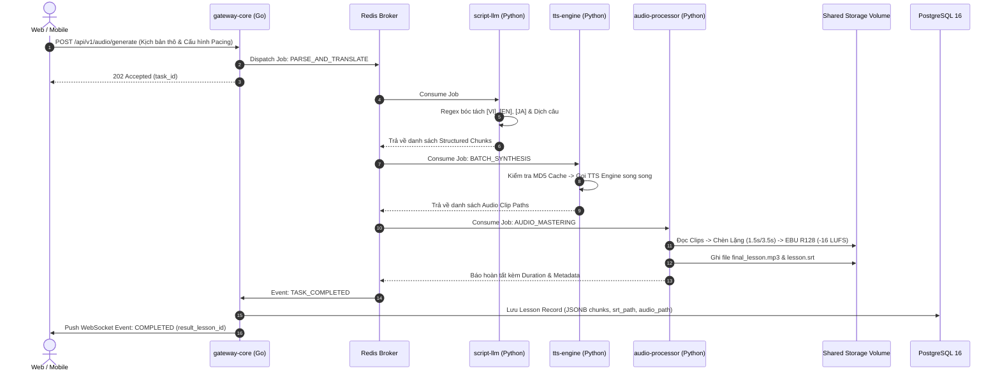

# 🛠️ CỤM VI DỊCH VỤ BACKEND & AI WORKERS (SERVICES)

Thư mục `services/` chứa toàn bộ mã nguồn của các vi dịch vụ phía máy chủ (Polyglot Microservices: Golang & Python). Hệ thống được thiết kế theo nguyên tắc Decoupling: **Golang Gateway đóng vai trò nhạc trưởng điều phối duy nhất giao tiếp với PostgreSQL**, trong khi các **Python AI Workers hoạt động độc lập bất đồng bộ qua Redis Streams / Task Queue và Shared Storage**.

---

## 📋 Danh Sách Các Vi Dịch Vụ

| Vi dịch vụ | Ngôn ngữ & Framework | Cổng Docker | Cẩm nang kỹ thuật chi tiết | Vai trò chính |
| :--- | :--- | :---: | :--- | :--- |
| **`gateway-core`** | **Golang 1.22+ (Fiber/Gin)** | `8000` | **[gateway-core/README.md](./gateway-core/README.md)** | API Gateway, Auth, WebSocket Hub, HTTP 206 Streaming, Dispatcher |
| **`script-llm`** | **Python 3.11+ (FastAPI)** | `8001` | **[script-llm/README.md](./script-llm/README.md)** | Regex Parser `[VI]`, `[EN]`, `[JA]`, Phân đoạn 3-4 câu, Ollama Qwen 2.5 |
| **`tts-engine`** | **Python 3.11+ (FastAPI)** | `8002` | **[tts-engine/README.md](./tts-engine/README.md)** | Multi-engine (Edge-TTS, Kokoro, Fish-Speech), Smart Cache MD5 |
| **`audio-processor`**| **Python 3.11+ (FFmpeg/Pydub)** | `8003` | **[audio-processor/README.md](./audio-processor/README.md)** | Pacing Silence (1.5s/3.5s), Mastering EBU R128 (-16 LUFS), Sinh SRT/VTT |

---

## 🔄 Luồng Tương Tác Giữa Các Vi Dịch Vụ (Workflow)



---

## 🚀 Hướng Dẫn Khởi Chạy Nhanh

1. **Khởi chạy toàn bộ bằng Docker:**
   ```bash
   # At repository root:
   docker compose up -d
   ```
2. **Khởi chạy riêng lẻ từng service:**
   Vui lòng truy cập vào `README.md` của từng service tương ứng để xem hướng dẫn chi tiết về cấu hình biến môi trường (`.env`), cài đặt dependencies và lệnh debug độc lập.
