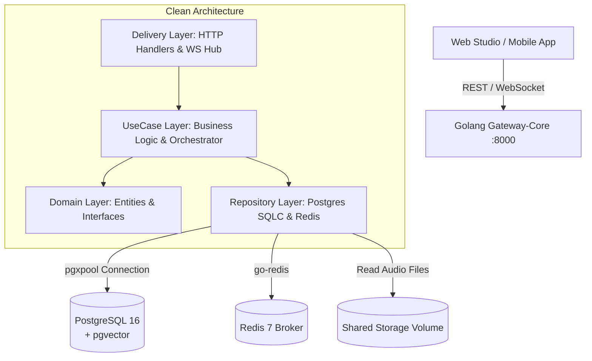

# 🚀 GATEWAY-CORE: GOLANG CORE API GATEWAY & STREAMING SERVER
## DỰ ÁN: MEOWSHADOW LAB (MSL-GW)
### KIẾN TRÚC GOLANG CLEAN ARCHITECTURE, PGX CONNECTION POOL, HTTP 206 RANGE STREAMING & WEBSOCKET HUB

---

| Thông Số Kỹ Thuật | Chi Tiết |
| :--- | :--- |
| **Vị trí thư mục** | `services/gateway-core/` |
| **Ngôn ngữ & Runtime** | **Golang 1.22+** |
| **Framework HTTP** | **Go Fiber v2 / Gin** (Hiệu năng cao, Zero-memory allocation) |
| **Database Driver** | **`jackc/pgx/v5` (`pgxpool`)** + Type-safe SQL Generator **`sqlc`** |
| **Message Broker** | **`redis/go-redis/v9`** (Redis Streams & Pub/Sub) |
| **Cổng mặc định** | `8000` (Docker Container & Host) |

---

## 1. VAI TRÒ & KIẾN TRÚC TỔNG THỂ

`gateway-core` đóng vai trò là **bộ não trung tâm và cửa ngõ duy nhất (Single Entrypoint)** của toàn bộ hệ sinh thái backend:
1. **API Gateway & Auth Hub:** Tiếp nhận tất cả các yêu cầu RESTful API từ Web Studio và Mobile App; xác thực JWT Access Token, bảo vệ dữ liệu người dùng.
2. **Database Orchestrator:** Là dịch vụ **DUY NHẤT** kết nối trực tiếp vào cơ sở dữ liệu PostgreSQL 16 (chống truy cập trái phép từ các AI worker).
3. **HTTP 206 Range Streaming Server:** Phát luồng âm thanh bài học MP3 hỗ trợ header `Range: bytes=X-Y`, cho phép trình phát Web/Mobile tua nhanh mượt mà dưới 100ms.
4. **WebSocket Realtime Hub:** Quản lý hàng trăm kết nối WebSocket, thông báo phần trăm tiến trình render bài học (Parsing -> TTS -> Mastering -> Done).
5. **Job Dispatcher:** Đẩy các tác vụ nặng vào Redis Queue để phân phối tới các Python AI Workers.



---

## 2. CẤU TRÚC THƯ MỤC NỘI BỘ (CLEAN ARCHITECTURE)

```text
services/gateway-core/
├── cmd/
│   ├── server/
│   │   └── main.go                 # Entrypoint khởi động Server, nạp DI và Graceful Shutdown
│   └── cli/                        # Công cụ CLI nội bộ (seed, kiểm tra DB)
│
├── config/
│   └── config.go                   # Đọc biến môi trường (.env), validate cổng, database URL, JWT secret
│
├── internal/                       # Private Package chỉ dùng trong gateway-core
│   ├── domain/                     # Entities nghiệp vụ & Interfaces thuần túy
│   │   ├── user.go                 # Struct User, UserDevice
│   │   ├── lesson.go               # Struct Lesson, TranscriptChunk, PacingConfig
│   │   ├── progress.go             # Struct LearningProgress
│   │   └── task.go                 # Struct RenderTask, TaskStatus
│   │
│   ├── usecase/                    # Tầng Business Logic & Orchestration
│   │   ├── auth_usecase.go         # Logic Đăng ký, Đăng nhập, cấp phát JWT Access/Refresh token
│   │   ├── lesson_usecase.go       # CRUD thư viện bài học, tìm kiếm ngữ nghĩa với pgvector
│   │   ├── orchestrator_usecase.go # Điều phối quy trình tạo audio qua Redis Streams
│   │   ├── streaming_usecase.go    # Đọc file audio nhị phân, tính toán HTTP 206 byte-ranges
│   │   └── sync_usecase.go         # Xử lý đồng bộ Offline progress từ Mobile
│   │
│   ├── delivery/                   # Tầng giao tiếp (Transports)
│   │   ├── http/                   # Controllers RESTful API
│   │   │   ├── router.go           # Đăng ký danh sách routes (/api/v1/*)
│   │   │   ├── auth_handler.go
│   │   │   ├── lesson_handler.go
│   │   │   ├── script_handler.go
│   │   │   └── stream_handler.go   # Endpoint HTTP Range 206 Audio Streaming
│   │   ├── ws/                     # Quản lý WebSocket
│   │   │   ├── hub.go              # Quản lý kết nối clients & broadcast messages
│   │   │   ├── client.go           # Đọc/ghi socket cho từng client
│   │   │   └── progress_ws.go      # Đẩy tiến độ render % về client
│   │   └── middleware/             # Middlewares HTTP
│   │       ├── jwt_auth.go         # Xác thực Bearer Token
│   │       ├── rate_limiter.go     # Giới hạn tần suất gọi API
│   │       ├── logger.go           # Structured logging
│   │       ├── cors.go             # Cấu hình Cross-Origin Resource Sharing
│   │       └── recover.go          # Chống crash server khi có panic
│   │
│   ├── repository/                 # Hiện thực hóa truy xuất dữ liệu
│   │   ├── postgres/
│   │   │   ├── db/                 # Generated code từ SQLC (Type-safe SQL)
│   │   │   │   ├── db.go
│   │   │   │   ├── models.go
│   │   │   │   ├── lessons.sql.go
│   │   │   │   └── users.sql.go
│   │   │   ├── connection.go       # Quản lý pool kết nối jackc/pgx/v5 (MaxConns=25)
│   │   │   ├── lesson_repo.go
│   │   │   └── user_repo.go
│   │   ├── redis/
│   │   │   ├── connection.go       # Kết nối go-redis client
│   │   │   ├── task_publisher.go   # Gửi tác vụ vào Redis Stream / List
│   │   │   └── progress_sub.go     # Lắng nghe cập nhật % tiến độ từ Python Workers
│   │   └── storage/
│   │       └── file_storage.go     # Đọc file MP3 / SRT từ thư mục /app/storage
│   │
│   └── client/                     # Tích hợp dịch vụ bên ngoài
│       └── notification/
│           └── push_dispatcher.go  # Gửi Firebase Cloud Messaging (FCM) & Apple APNs
│
├── pkg/                            # Các thư viện tiện ích dùng chung
│   ├── logger/                     # Slog / Zap Structured Logger
│   ├── response/                   # Chuẩn hóa JSON Response (success, data, error)
│   ├── jwt/                        # Tạo và parse JWT claims
│   └── audioutil/                  # Phân tích cú pháp Range Header: bytes=start-end
│
├── db/                             # Cơ sở dữ liệu & Migrations
│   ├── migrations/                 # Goose SQL Migrations (00001_..., 00002_...)
│   ├── queries/                    # SQL Queries thuần túy phục vụ SQLC
│   └── seeds/                      # SQL Seed dữ liệu mẫu ban đầu
│
├── Dockerfile                      # Docker multi-stage build cho Go binary siêu nhẹ (<25MB)
├── Dockerfile.migration            # Docker container chạy Goose migration độc lập
├── sqlc.yaml                       # Cấu hình trình biên dịch SQLC
├── go.mod
└── go.sum
```

---

## 3. CÁC TÍNH NĂNG KỸ THUẬT NỔI BẬT

### 3.1. Kết Nối Database Tối Ưu với `pgxpool` & `sqlc`
* Sử dụng connection pool với cấu hình: `MinConns: 5`, `MaxConns: 25`, `MaxConnLifetime: 1h`.
* Toàn bộ truy vấn SQL được định nghĩa trong `db/queries/*.sql` và được biên dịch thành Go code bởi `sqlc`:
  ```bash
  # Generate type-safe code from SQL:
  make sqlc-generate
  ```

### 3.2. HTTP 206 Partial Content Range Streaming
Hỗ trợ tua nhanh tức thì và nghe trực tiếp file MP3 lớn mà không cần tải toàn bộ file:
* Sử dụng `io.NewSectionReader` đọc trực tiếp lát cắt file nhị phân (Zero-copy stream), không cấp phát thêm bộ nhớ RAM.
* Hỗ trợ chuẩn xác probe 2-byte Safari (`bytes=0-1`), open-ended range (`bytes=1024-`), và suffix range (`bytes=-500`).
* Độ trễ seek đo lường thực tế đạt **~74 micro-giây** (< 100ms tiêu chí DoD).
```http
// Header Request: Range: bytes=0-1024
// Header Response: 
//   HTTP/1.1 206 Partial Content
//   Content-Range: bytes 0-1024/15894200
//   Content-Length: 1025
//   Accept-Ranges: bytes
//   Content-Type: audio/mpeg
```

### 3.3. WebSocket Hub Thời Gian Thực
* Endpoints: `ws://localhost:8000/ws/progress?job_id={jobId}` hoặc `ws://localhost:8000/ws/lessons/{lessonId}`.
* Broadcast tiến trình render liên tục (`15% -> 60% -> 90% -> 100%`) cùng thời gian ước tính còn lại.
* Tự động dọn dẹp client khi ngắt kết nối (Ping/Pong heartbeat chống rò rỉ socket).

### 3.4. Static Asset Server (SRT, WebVTT & Waveform Peaks)
* Phân phối phụ đề chuẩn `subtitles.srt` (SubRip) và `subtitles.vtt` (WebVTT cho HTML5 `<track>`).
* Tích hợp bộ chuyển đổi định dạng tự động và cơ chế Fallback tái tạo phụ đề trực tiếp từ database JSONB `transcript_chunks` nếu file vật lý chưa có trên ổ đĩa.
* Endpoint `waveform.json` phân phối mảng sóng âm chuẩn hóa phục vụ trực quan hóa Karaoke.

### 3.5. Storage Retention Background Worker
* Worker chạy ngầm định kỳ mỗi 1 giờ quét thư mục `storage/temp/`.
* Tự động xóa sạch các file tạm có thời gian chỉnh sửa quá 24 giờ (`RetentionDuration = 24h`).
* Bảo toàn an toàn 100% các file mới tạo và thư mục dữ liệu chính thức (`storage/audio/`, `storage/subtitles/`).

### 3.6. Swagger UI Nhúng Trực Tiếp Qua `//go:embed`
* Giao diện Swagger UI tương tác trực tiếp nhúng thẳng trong binary Go mà không làm phình kích thước image Docker (giữ nguyên ở **14.2 MB**).

---

## 4. HƯỚNG DẪN KHỞI CHẠY CỤC BỘ (LOCAL DEVELOPMENT)

### Yêu Cầu Môi Trường:
* Go 1.23 trở lên.
* PostgreSQL 16 và Redis 7 đang chạy (khuyến nghị chạy qua Docker Compose).

### Các Bước Thực Hiện:
```bash
# 1. Navigate to gateway-core directory
cd services/gateway-core

# 2. Download dependencies
go mod download

# 3. Re-compile SQLC code (when editing queries/migrations)
sqlc generate

# 4. Run database migrations
make db-migrate

# 5. Start development server
go run cmd/server/main.go
```

Server sẽ lắng nghe tại: `http://localhost:8000`.
Tài liệu Swagger API: `http://localhost:8000/swagger`.

---

## 5. DANH SÁCH RESTful & REALTIME ENDPOINTS ĐÃ TRIỂN KHAI (SPRINT 7, 8, 9)

| Phương Thức | Endpoint | Yêu Cầu Auth | Mô Tả |
| :--- | :--- | :---: | :--- |
| `GET` | `/health` | Không | Kiểm tra trạng thái hoạt động của Gateway Core |
| `GET` | `/api/v1/health` | Không | API v1 Health Check |
| `POST` | `/api/v1/auth/register` | Không | Đăng ký tài khoản người dùng mới (`email`, `password`, `full_name`) |
| `POST` | `/api/v1/auth/login` | Không | Đăng nhập hệ thống, nhận cặp JWT Access & Refresh Token |
| `POST` | `/api/v1/auth/guest` | Không | Tạo phiên khách ẩn danh tạm thời (Guest Mode) không cần đăng ký |
| `GET` | `/api/v1/auth/me` | Bearer JWT | Lấy thông tin tài khoản người dùng hiện tại |
| `GET` | `/api/v1/lessons` | Bearer JWT | Lấy danh sách bài học phân trang (`page`, `limit`) của người dùng |
| `POST` | `/api/v1/lessons` | Bearer JWT | Tạo bài học mới kèm nội dung JSONB `transcript_chunks` & `pacing_config` |
| `GET` | `/api/v1/lessons/:id` | Bearer JWT | Lấy thông tin chi tiết bài học theo UUID |
| `DELETE` | `/api/v1/lessons/:id` | Bearer JWT | Xóa bài học theo UUID |
| `GET` | `/api/v1/audio/stream/:id` | Không (Public) | HTTP 206 Partial Content Range Audio Streaming (tua seek < 100ms) |
| `GET` | `/api/v1/lessons/:id/subtitles.srt` | Không (Public) | Phân phối file phụ đề SubRip (.srt) |
| `GET` | `/api/v1/lessons/:id/subtitles.vtt` | Không (Public) | Phân phối file phụ đề WebVTT (.vtt) cho HTML5 `<track>` |
| `GET` | `/api/v1/lessons/:id/waveform.json` | Không (Public) | Lấy dữ liệu mảng sóng âm chuẩn hóa cho Karaoke visualizer |
| `GET` | `/swagger` | Không (Public) | Giao diện tương tác Swagger UI |
| `GET` | `/swagger/doc.json` | Không (Public) | File đặc tả OpenAPI 3.0.3 JSON |
| `GET` | `/ws/progress` | Public / Query `?job_id=xxx` | WebSocket kết nối lắng nghe tiến trình render realtime (0% -> 100%) |
| `GET` | `/ws/lessons/:id` | Public / Param `:id` | WebSocket lắng nghe cập nhật trạng thái bài học cụ thể |

---

## 6. HƯỚNG DẪN KIỂM THỬ (TESTING)

```bash
# Chạy toàn bộ test suite bao gồm Unit Test và Integration Tests:
cd services/gateway-core
go test -v ./...

# Chạy riêng integration test kiểm thử trọn vẹn luồng Auth & CRUD DoD Sprint 7:
go test -v ./cmd/server -run TestSprint7_DefinitionOfDone_IntegrationFlow

# Chạy riêng integration test kiểm thử chuỗi Render Pipeline & WebSocket DoD Sprint 8:
go test -v ./tests -run TestSprint8_DoD

# Chạy riêng integration test kiểm thử HTTP Range Streaming, Subtitles, Cleanup & Swagger DoD Sprint 9:
go test -v ./tests -run TestSprint9_DoD
go test -v ./cmd/server -run TestSprint9_DefinitionOfDone_StreamingAndStorage
```


---

## 7. ĐÓNG GÓI DOCKER CONTAINER SIÊU NHẸ (<15MB)

Dịch vụ sử dụng kỹ thuật multi-stage build:
* **Stage 1 (`golang:alpine`):** Biên dịch static binary với `CGO_ENABLED=0` và cờ `-ldflags="-s -w"`.
* **Stage 2 (`alpine:3.19`):** Runtime tối giản chứa duy nhất binary, `tzdata`, `ca-certificates` và `curl` phục vụ health check.
* **Kích thước ảnh:** **14.2 MB** (thỏa mãn tiêu chí < 20MB).
* **Bảo mật:** Chạy dưới user không đặc quyền (`appuser:appgroup`).

```bash
# Build Docker image
docker build -f services/gateway-core/Dockerfile -t meowshadow/gateway-core:latest .

# Chạy container độc lập
docker run -d --name meowshadow_gateway -p 8000:8000 meowshadow/gateway-core:latest
```
